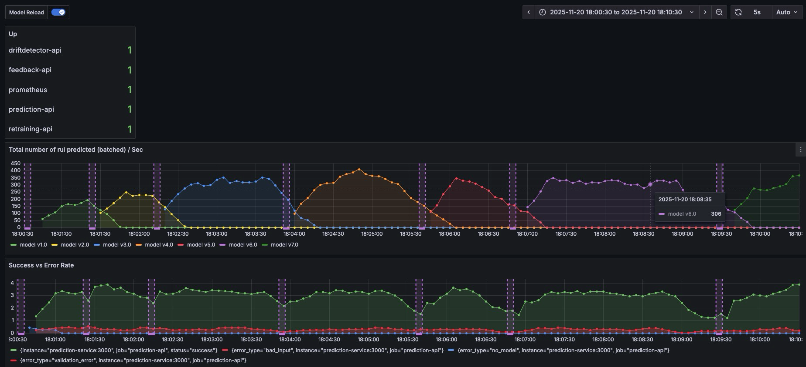
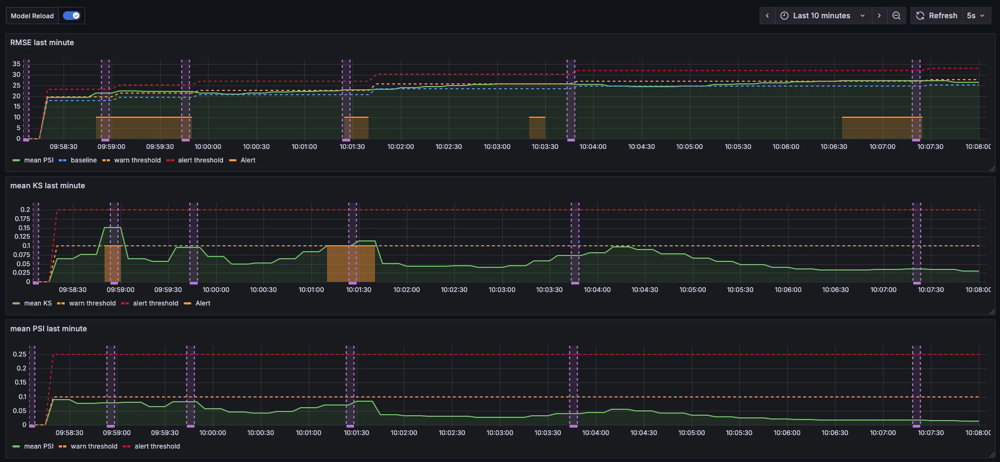
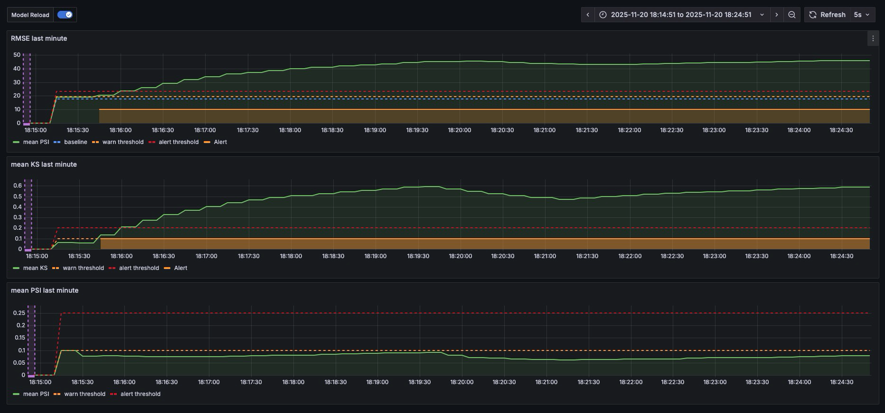
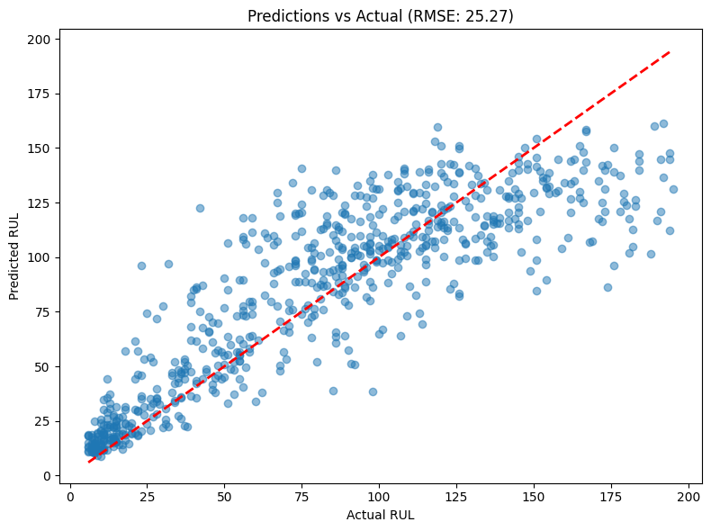

# ML Lifecycle

## Turbofan Predictive Maintenance

This repository implements a portfolio Machine Learning project for predictive maintenance on turbofan engine data. It demonstrates the full ML lifecycle end-to-end: training, deployment, monitoring, drift detection, and automated retraining — all runnable locally with Docker and Python. The focus is on lifecycle robustness and reproducibility, not squeezing the last decimals of accuracy.

## Project Overview
- Problem: predict Remaining Useful Life (RUL) / failure risk for turbofan engines.
- Lifecycle stages: training, model serving, feedback collection, monitoring, drift detection, automated retraining.
- Production-like aspects: microservices (BentoML), metrics (Prometheus), dashboards (Grafana), experiment tracking (MLflow), Docker Compose orchestration, local demo traffic generator.
- Positioning: end-to-end ML eng/MLOps project, not state-of-the-art RUL. The project is thought to be fast, and run on any computer. Not to produce competitive RUL predictions.
- Code quality assurance: Tox, Mypy and Github Actions CI/CD.


## System Architecture

```
+-------------------+      +--------------------+      +-------------------+
|  Data & Features  | ---> |  Model Training &  | ---> |   Model Bundle    |
| (download_raw_*)  |      |   Packaging (RF)   |      | (data/models/*.joblib)
+---------+---------+      +----------+---------+      +----------+--------+
          |                             |                          |
          |                             |                          v
          |                             |                +-------------------+
          |                             +--------------> |  Prediction API   |
          |                                              | (BentoML, :3000)  |
          |                                              +----------+--------+
          |                                                         |
          |                                                   predictions
          |                                                         v
          |                                              +----------+--------+
          |                                              |  Feedback API     |
          |                                              | (BentoML, :3001)  |
          |                                              +----------+--------+
          |                                                         |
          |                                                feedback JSONL
          v                                                         v
+---------+---------+      drift signals      +---------------------+--------+
| Monitoring:       | <--------------------- | Drift Detector (3003)        |
| Prometheus (9090) | ---------------------> | triggers retraining if alert |
| Grafana (3002)    | metrics & dashboards   +-----------+------------------+
+-------------------+                                     |
                                                         retrain
                                                          v
                                              +-----------+-----------+
                                              | Retraining Service    |
                                              | (BentoML, :3004)      |
                                              +-----------------------+

[Run tracking & artifacts logged to MLflow (5000); Prediction API -> file watcher for new models.]
```

- Training/experimentation: Python scripts with MLflow tracking; model saved as a single bundle file with metadata.
- Serving: BentoML microservices for prediction, feedback, drift detection, and retraining.
- Feedback: JSONL storage to close the loop and compute basic accuracy stats.
- Monitoring: Prometheus metrics from services + Grafana dashboards.
- Drift detection: PSI/KS style feature drift metrics and RMSE deltas; can trigger retraining.
- Local-first: designed to run on a single machine via Docker Compose.

## Tech Stack
- Python (pydantic, pandas, numpy, scikit-learn)
- Serving: BentoML
- Monitoring: Prometheus + Grafana (pre-provisioned dashboards)
- Experiment tracking: MLflow (for runs/metrics; not using Model Registry)
- Orchestration: Docker & Docker Compose


## Dashboards and explanations

### Overview
  

Shows health of each services.  
The number of predictions made, and errors (generated from bad input in the demo script).  
Each different color is a different trainned model.  
Vertical purple lines are retraining triggers. 


### Drift


Grafana dashboard (10 minutes) for drift metrics and retraining trigger.

#### Metrics

- **RMSE baseline**: RMSE of the last minute prediction and the actual RUL vs baseline for the last trained model. Warning (orange line) triggers retraining.
- **KS**: Kolmogorov-Smirnov statistic for feature drift (KS > 0.1). Warning (orange line) triggers retraining.
- **PSI**: Percentage of features that have changed significantly (PSI > 0.1). Warning (orange line) triggers retraining.

Each orange rectange signifies a drift signal -> calling for a retraining.  
Each purple line is a newly trained model (v1.0, v2.0, v3.0, etc).  

#### Without any retraining, it looks like this :  



## Data & Modeling

Dataset: NASA C-MAPSS turbofan engine degradation time series (multiple units, cycles, sensor readings).   
Source: https://www.kaggle.com/datasets/behrad3d/nasa-cmaps


- Features: per-engine time-based features on multiple cycles (3 settings, 21 sensors).
- Already delivered with a train split, and a test split. We have ground truth RUL for both of them.
- Model: Random Forest (scikit-learn) for speed/simplicity and quick iterations. Model bundles and feature names are tracked and hot-reloaded by the prediction service.
- Results: reasonable RUL prediction performance for demonstrating lifecycle behaviors. The emphasis is on the system performances rather than SOTA metrics. (for this portfolio project)
- Future: explore LSTM/GRU or other sequence models for improved sequence modeling.

Current performances with RandomForest, simple hyperparameters, all FE, and training and all train data and test on all test data:   


## Demo explanation - drift strategy
- Train and Test set both have the same number of Engine Units (but different time series for each of them). The Test set simply has different 'flight conditions' (different distributions of sensor data through time).
- We train on a subset of Train data and evaluate the corresponding unit of the Test set. 
- The demo strats with the first 10% of the Train set to train the first model. (and RMSE baseline made with the corresponding 10% of the Test set)
- The demo script then send data (from Test set) to the Prediction API and collect feedback (RUL predictions and ground truths)
- The feedback is used to compute metrics and trigger drift detection in another service. (see drift dashboard above)
- If a drift is detected, the retraining service retrain on the Train set corresponding to the units of the Test set used in 'production.'
- As soon as a new model is trained, the prediction service is updated with the new model bundle and hot-reloaded.
- The demo continues until the end of the Test set.. which is programmed to last 10 minutes.

## Quickstart

Prereqs: macOS/Linux, **Python 3.13+**, Docker, Kaggle API token, and a populated `.env` file.

1) Clone and enter the repo
```bash
git clone https://github.com/<you>/Turbofan-ML-lifecycle.git
cd Turbofan-ML-lifecycle
```
2) Create `.env` from example (mandatory)
```bash
cp .env.example .env
```
3) Create a venv and install deps via uv
```bash
python -m venv .venv && source .venv/bin/activate
python -m pip install uv && uv sync
```
4) Configure Kaggle token, then download & prepare data  
- Get token: https://www.kaggle.com/settings → Create New Token → save to `~/.kaggle/kaggle.json`
- This download data, prepare it, and make feature engineering (mandatory):
```bash
uv run initialize
```
5) Start the stack (build all images)
```bash
docker compose up --build
```
Dashboards:
- [Grafana Overview](http://localhost:3002/d/ad2v2fs/prediction-overview?orgId=1&from=now-10m&to=now&timezone=browser&refresh=auto&tab=queries) (anonymous access enabled locally)
- [Grafana Drift Dashboard](http://localhost:3002/d/ad5r62c/rmse-drift-detection?orgId=1&from=now-10m&to=now&timezone=browser&refresh=5s) (anonymous access enabled locally)


Then, wait for all services to be up (see grafana 'Overview dashboard') and in another terminal, run the demo script:
```bash
source .venv/bin/activate && uv run continuous
```
From here, the demo takes 10 minutes to complete.  

You can at any point stop the demo script with `Ctrl+C` in the terminal running it, and then stop the stack with `docker compose down`.

Other links:
- Prometheus: http://localhost:9090
- MLflow: http://localhost:5000
- Prediction API (BentoML): http://localhost:3000 (used by the demo script)

## What this project contains
- Time-series predictive maintenance feature engineering
- Reproducible training/evaluation with experiment tracking (MLflow)
- Model serving with a proper API (BentoML)
- Metrics instrumentation and dashboards (Prometheus + Grafana)
- Drift detection and automated retraining loop
- Containerized, local, production-like environment (Docker Compose)

## Roadmap / Future Work
- Sequence models (LSTM/GRU) for better temporal dynamics
- Hardening for production: CI/CD, more tests, container hardening, k8s (mini kube) deployment
